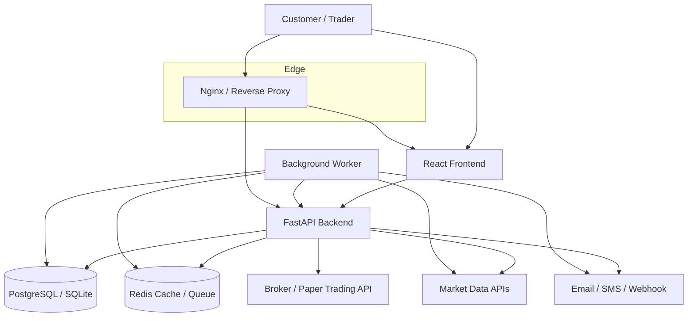
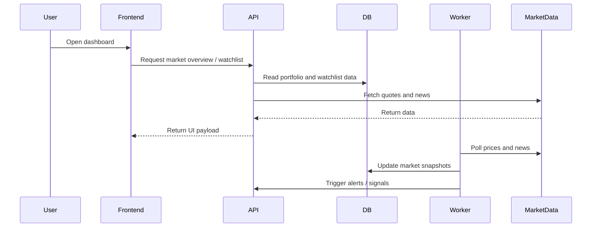

# Deployment Architecture Diagram

## 1. System Overview Diagram

---

## 2. Detailed Component Introduction

### Client Layer
- React frontend provides a rich UI for market monitoring, watchlists, alerts, signals, portfolio views, and order entry.
- Users interact with dashboards and receive actionable notifications.

### Gateway Layer
- Nginx or another reverse proxy handles HTTPS termination, routing, and static asset delivery.
- It also improves security and simplifies deployment.

### Application Layer
- FastAPI serves the API for trading operations, watchlists, signals, market intelligence, and notifications.
- It exposes endpoints that the frontend consumes.

### Data Layer
- PostgreSQL or SQLite stores persistent data such as users, watchlists, portfolios, orders, and signals.
- Redis stores caching, queues, session state, and fast operational data.

### Integration Layer
- Market data APIs provide stock quotes and financial news.
- Broker or paper-trading APIs accept and track orders.
- Notification services deliver alerts to customers.

### Background Processing Layer
- Workers periodically fetch market data, calculate indicators, generate signals, and send notifications.
- This keeps the UI responsive while long-running tasks happen in the background.

---

## 3. Deployment Flow

---

## 4. Deployment Recommendation

### Single-server deployment
Use this for development or small production environments:
- Nginx serves the frontend and proxies API requests
- Backend runs as a service
- Redis and PostgreSQL run locally or in containers
- Workers run in the same host

### Multi-service deployment
Use this for larger-scale production:
- Separate frontend, API, worker, database, and Redis services
- Use Docker Compose or Kubernetes
- Add monitoring, backups, and autoscaling

---

## 5. Notes for Implementation

For this repository, the best fit is:
- Frontend served from the React build output
- Backend run from the FastAPI app in [service/server/main.py](../service/server/main.py)
- Market and trading routes extended from [service/server/routes_market.py](../service/server/routes_market.py) and [service/server/routes_trading.py](../service/server/routes_trading.py)

This architecture allows the system to grow from an MVP into a full trading and notification platform.
